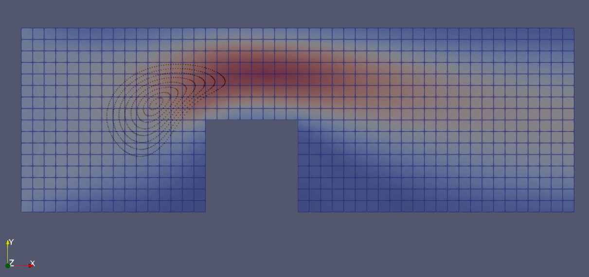


Get the [case files of this tutorial](https://github.com/precice/tutorials/tree/develop/channel-transport-particles), as continuously rendered here, or see the [latest released version](https://github.com/precice/tutorials/tree/master/channel-transport-particles) (if there is already one). Read how in the [tutorials introduction](https://precice.org/tutorials.html).


## Setup

We model a two-dimensional incompressible fluid flowing through a channel with an obstacle. The fluid problem is coupled to a particle participant for particle tracing. Similar to the transport problem (see the [channel-transport tutorial](tutorials-channel-transport.html)), particles are arranged in a circular blob close to the inflow. The particles then move along with the flow as depicted in the following figure



Note that this scenario features a unidirectional coupling, where the fluid velocity affects the particles, but the particles do not affect the fluid.

## Configuration

preCICE configuration (image generated using the [precice-config-visualizer](https://precice.org/tooling-config-visualization.html)):


## Available solvers

Fluid participant:

* Nutils. For more information, have a look at the [Nutils adapter documentation](https://precice.org/adapter-nutils.html). This Nutils solver requires at least Nutils v7.0.

* OpenFOAM (pimpleFoam). For more information, have a look at the [OpenFOAM adapter documentation](https://precice.org/adapter-openfoam-overview.html).

Particle participant:

* MercuryDPM. For the impatient: you may use the script `setup-mercurydpm.sh` to compile the required MercuryDPM solver, and `run.sh` to start the coupled simulation. The specific case is available as part of MercuryDPM. To use it, compile MercuryDPM with support for preCICE (`-D MercuryDPM_PreCICE_COUPLING="ON"`). You can compile the relevant executable only using `make ChannelTransport`. Afterwards, the executable `ChannelTransport` is available in the build tree. The `run.sh` script can pick-up the executable, if a `MERCURYDPM_BUILD_DIR` has been exported. Copying the executable or providing it as a command line argument is also possible. Use `run.sh --help` for detailed information. Note that the drag model is mostly an arbitrary choice to validate the technical correctness, but it has no physical background.

## Running the simulation

For the fluid solver, use Nutils for ease of installation and OpenFOAM for speed.

Open two separate terminals and start one fluid and one transport participant by calling the respective run scripts `run.sh` located in each of the participants' directory. For example:

```bash
cd fluid-nutils
./run.sh
```

and the particle solver

```bash
cd particles-mercurydpm
./run.sh
```

## Post-processing

All solvers generate `vtk` files which can be visualized using, e.g., ParaView.
