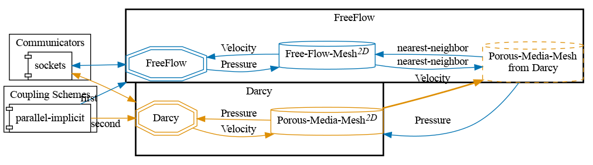
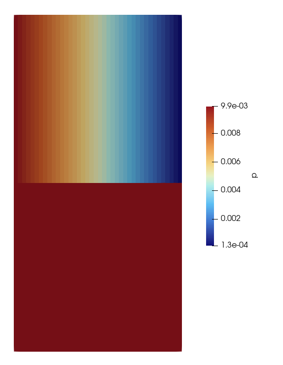
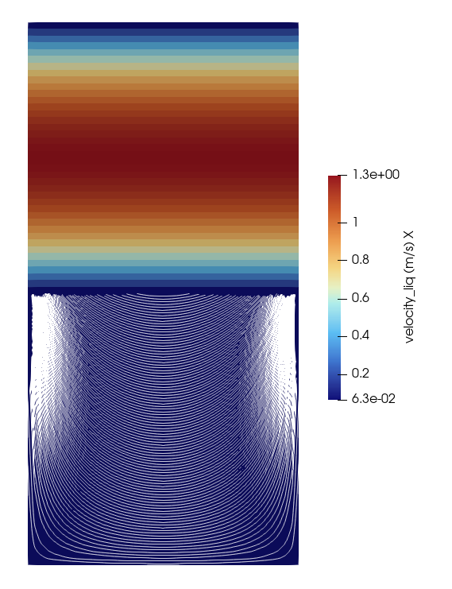


Get the [case files of this tutorial](https://github.com/precice/tutorials/tree/develop/free-flow-over-porous-media), as continuously rendered here, or see the [latest released version](https://github.com/precice/tutorials/tree/master/free-flow-over-porous-media) (if there is already one). Read how in the [tutorials introduction](https://precice.org/tutorials.html).


## Setup

This tutorial solves a coupled system consisting of a one-phase free flow and a one-phase flow in a porous media.

A pressure gradient is applied to the free flow domain from left to right. The top edge of the free-flow is a non-permeable wall with no-slip boundary conditions. In the porous media, there is a no-flow condition across the domain boundaries (left, bottom, and right boundaries). At the interface, a no-slip condition applies. The case is stationary (solved to a steady-state solution).

The setting is illustrated in the following figure:


## Configuration

preCICE configuration (image generated using the [precice-config-visualizer](https://precice.org/tooling-config-visualization.html)):



## Available solvers

Both the participants are computed using the simulation code [DuMux](https://git.iws.uni-stuttgart.de/dumux-repositories/dumux/).

## Solver setup

To solve the flows with the DuMux framework, the necessary DUNE modules need to be downloaded and set up. This is done by running `sh setup-dumux.sh` in the tutorial folder.

If an existing path, containing compiled DUNE modules, DuMux and DuMux-adapter, is to be used for compiling the solvers, the path can be specified by setting the arguments while running the script `run.sh` with `-l <path-to-DUNE-common>` in each solver folder. The environment variable `DUNE_CONTROL_PATH` is suppressed by the script. The `run.sh` scripts in the DuMux solver folders will first compile the solver if not already compiled, and then run the simulation.

## Running the simulation

Each participant has a `run.sh` script.

To run the free-flow participant, run:

```bash
cd free-flow-dumux
./run.sh
```

To run the porous-media participant, run:

```bash
cd porous-media-dumux
./run.sh
```

This assumes a DuMux and DUNE modules installation in the case folder. You can specify the path to an existing DUNE installation with with `-l`:

```bash
./run.sh -l <path-to-DUNE-common>
```

Participants can be executed only in serial. Parallel execution is not supported. The case takes approximately two minutes to finish.

## Post-processing

Both participants write VTU outputs, which can be viewed using ParaView.

## Further information

The results of the pressure and the velocity fields are as follows:




Each solver folder contains an input file (`params.input`) that will be passed to the solver executables. This is a DuMUX input file describing the simulation setting, e.g., pressure, mesh size, time stepping, etc.
